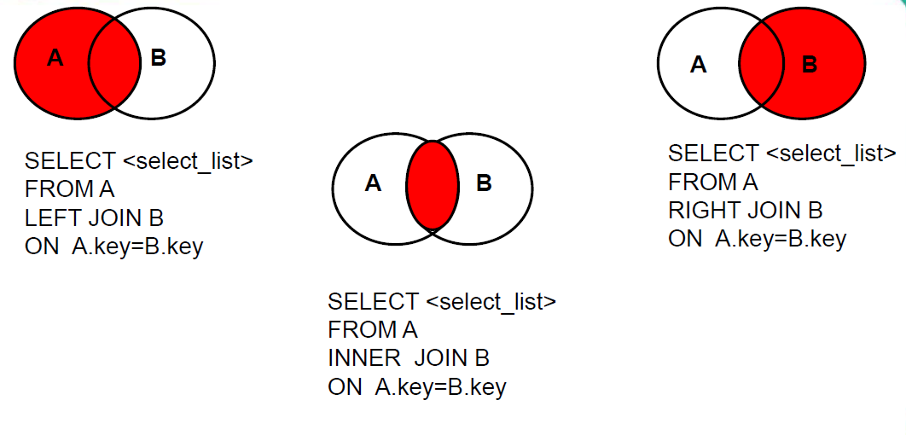

# MySQL入门系列(2) - 检索数据

## 基础用法

```mysql
# 检索单列
select column_name from table_name

# 检索多列
select column1_name,column2_name,... from table_name

# 检索所有列 * 通配符 匹配任意多个字符
select * from table_name

# 检索不同的值
select distinct column_name from table_name
## 此时只要(column1_name, column2_name) != (column1_name_another, column2_name_another)时就算不同，即distinct用于多个列时会把它们组合成一个向量，一旦某个分量不同则算作distinct，也就会被检索出来
select distinct column1_name, column2_name from table_name

# 限制结果 mysql索引从0开始
## 从索引1开始（包括索引1）往后取满5条记录
SELECT prod_name
FROM Products
LIMIT 5 OFFSET 1;
## 也可按如下方式简写
SELECT prod_name
FROM Products
LIMIT 1,5;
## 不带offset，等价于offset为0
SELECT prod_name
FROM Products
LIMIT 5;
```

## 排序检索数据

```mysql
# 按单个列排序 默认升序
SELECT prod_name
FROM Products
ORDER BY prod_name;

# 按多个列排序 一个升序 一个降序  ASC可以省略
SELECT prod_id, prod_price, prod_name
FROM Products
ORDER BY prod_price ASC, prod_name DESC;

# 按select清单中的相对列位置排序 列位置从1开始 和行记录不同，行记录从0开始
## 按prod_price, prod_name排序
SELECT prod_id, prod_price, prod_name
FROM Products
ORDER BY 2, 3;
```

## 过滤数据

### 比较运算符过滤

```mysql
# 使用where可以筛选数据
SELECT prod_name, prod_price
FROM Products
WHERE prod_price = 3.49;

# where 和 order by 一起使用
SELECT prod_name, prod_price
FROM Products
WHERE prod_price = 3.49;
order by prod_name;
```

常用基础数据过滤WHERE子句操作符：=, !=, >=, <=, >, <, BETWEEN ... AND ...(闭区间，左右都包含在内), IS NULL

### 逻辑运算符过滤

```mysql
# AND OR操作符 多个AND和OR，记住使用圆括号对操作符进行明确分组，否则操作顺序可能不是你想要的
SELECT prod_id, prod_price, prod_name
FROM Products
WHERE vend_id = 'DLL01' AND prod_price <= 4;

# IN操作符
SELECT prod_name, prod_price
FROM Products
WHERE vend_id IN ( 'DLL01', 'BRS01' )
ORDER BY prod_name;

# NOT操作符
## 匹配非DLL01之外的所有东西
SELECT prod_name
FROM Products
WHERE NOT vend_id = 'DLL01'
ORDER BY prod_name;
```

为什么要使用IN操作符？其优点为：

* 在有很多合法选项时，IN操作符的语法更清楚，更直观。
* 在与其他AND和OR操作符组合使用IN时，求值顺序更容易管理。
* IN操作符一般比一组OR操作符执行得更快。
* IN的最大优点是可以包含其他SELECT语句，能够更动态地建立WHERE子句

### 通配符过滤

```mysql
# %表示任何字符出现任意次数 包含0次 通配符%看起来像是可以匹配任何东西，但有个例外，这就是NULL 
# LIKE是谓词而不是操作符
## 找出所有以词Fish起头的产品
SELECT prod_id, prod_name
FROM Products
WHERE prod_name LIKE 'Fish%';

# 下划线的用途与%一样，但它只匹配单个字符
SELECT prod_id, prod_name
FROM Products
WHERE prod_name LIKE '__ inch teddy bear';

# 方括号（[ ]）通配符用来指定一个字符集，它必须匹配指定位置（通配符的位置）的一个字符
# 在Mysql中方括号属于正则表达式范畴，通配符不支持
## 匹配以l或H开头的名字
select name
from students 
where name REGEXP '[lH]+';
```

## 创建计算字段

```mysql
# 拼接字符串 AS用于取别名
SELECT Concat(vend_name, ' (',vend_country, ')') AS vend_title
FROM Vendors
ORDER BY vend_name;

# 执行算术计算 + - * /(浮点数除法)
SELECT prod_id,quantity,item_price,quantity*item_price AS expanded_price
FROM OrderItems
WHERE order_num = 20008;

# 去掉字符串空格
## 去掉字符串左边空格
select ltrim('          haha s          ') as t;
## 去掉字符串右边空格
select rtrim('          haha s          ') as t;
## 去掉字符串两边空格
select trim('          haha s          ') as t;
```

## 函数

### 常用文本处理函数

|      函数名      |                   说明                   |
| :--------------: | :--------------------------------------: |
|      length      |    获取字节长度（注意：不是字符长度）    |
|      concat      |                   连接                   |
| trim/ltrim/rtrim |                 去掉空格                 |
| substr/substring |                 截取子串                 |
|   upper/lower    |               变大写/小写                |
|     replace      |                   替换                   |
|    lpad/rpad     |          指定字符左填充/右填充           |
|      instr       | 获取子串第一次出现的索引,如果找不到返回0 |

```mysql
# 截取子串
## 截取从指定索引处后面所有字符
SELECT SUBSTR('李莫愁爱上了陆展元',7);
## 返回'陆湛远'
## 注意：索引从1开始

## 截取从指定索引处指定字符长度的字符（注意：不是字节长度）
SELECT SUBSTR('李莫愁爱上了陆展元',1,3);
## 返回'李莫愁'
SELECT SUBSTR('haha',2,3);
## 返回'aha'

# 替换
SELECT REPLACE('周芷若张无忌爱上了周芷若','周芷若','赵敏') AS out_put;
## 返回'赵敏张无忌爱上了赵敏'

# 指定字符填充
SELECT LPAD('殷素素',10,'*') AS out_put;
## 返回'*******殷素素'
SELECT LPAD('殷素素',2,'*') AS out_put;
## 返回'殷素',说明超过了指定长度会被截断
```

### 日期和时间处理函数

|       函数名       |          说明          |
| :----------------: | :--------------------: |
|        now         |   返回当前日期+时间    |
|   year/month/day   |      返回年/月/日      |
|    date_format     |    将日期转换成字符    |
|  curdate/curtime   |   返回当前日期/时间    |
|    str_to_date     |    将字符转换成日期    |
| hour/minute/second |    返回小时/分钟/秒    |
|      datediff      | 返回两个日期相差的天数 |

```mysql
SELECT YEAR('1998-1-1');
## 返回1998

SELECT DATE_FORMAT('1999-4-3','%Y年%m月%d日') AS out_put;
## 返回'1999年04月03日'

SELECT STR_TO_DATE('9-13-1999','%m-%d-%Y');
## 返回'1999-09-13'

SELECT DATEDIFF('1999-4-5','1999-4-4') AS out_put;
## 返回1
SELECT DATEDIFF('1999-4-3','1999-4-4') AS out_put;
## 返回-1
```

| 格式符 | 功能                  |
| ------ | --------------------- |
| %Y     | 4位的年份             |
| %y     | 2位的年份             |
| %m     | 月份(01,02,...,11,12) |
| %c     | 月份(1,2,...,11,12)   |
| %d     | 日(01,02,...)         |
| %H     | 小时(24小时制)        |
| %h     | 小时(12小时制)        |
| %i     | 分钟(00,01,...,59)    |
| %s     | 秒(00,01,...,59)      |

### 数值处理函数

|      函数名      |                   说明                    |
| :--------------: | :---------------------------------------: |
|       ABS        |            返回一个数的绝对值             |
|       COS        |            返回一个角度的余弦             |
|       EXP        |            返回一个数的指数值             |
|        PI        |                返回圆周率                 |
|       SQRT       |            返回一个数的平方根             |
| ceil/floor/round |        向上取整/向下取整/四舍五入         |
|       mod        | 取模（结果的正负号和被除数a的正负号一致） |
|       rand       |       获取随机数，返回0-1之间的小数       |
|     truncate     |                   截断                    |

```mysql
SELECT TRUNCATE(1.699,1);
#返回1.6
#第二个参数的数字代表截断保留几位小数

SELECT ROUND(1.65);
#返回2
SELECT ROUND(-1.65);
#返回-2
SELECT ROUND(1.567,2);
#返回1.57
```

### 流程控制函数

* if(条件表达式，表达式1，表达式2)：如果条件表达式成立，返回表达式1，否则返回表达式2

* switch-case

  * case情况1

  ```mysql
   case 变量或表达式或字段
   when 常量1 then 值1或语句1;/*值的话末尾不要加分号*/
   when 常量2 then 值2或语句2;
   ...
   else 值n或语句n;
   end case;/*值的话末尾不要加case*/
  ```

  * case情况2

  ```mysql
   case 
   when 条件1 then 值1或语句1;/*值的话末尾不要加分号*/
   when 条件2 then 值2或语句2;
   ...
   else 值n或语句n;
   end case;/*值的话末尾不要加case*/
   /* 这种方式可以判断位于某个区间这种条件,而case情况1不行 /*
  ```

### 分组函数/聚合函数

#### 常用聚合函数

- max 最大值
- min 最小值
- sum 和
- avg 平均值
- count 计算个数
  - 使用COUNT(*)对表中行的数目进行计数，不
    管表列中包含的是空值（NULL）还是非空
    值。
  -  使用COUNT(column)对特定列中具有值的行
    进行计数，忽略NULL值。
  - count(1):相当于加入全1的一列，然后计数，所以还是用于统计总的行数

#### 聚集不同值

* 对所有行执行计算，指定ALL参数或不指定参数（因为ALL是默认行为）
* 只包含不同的值，指定DISTINCT参数。DISTINCT不能用于COUNT(*)

```mysql
# 平均值只考虑各个不同的价格
SELECT AVG(DISTINCT prod_price) AS avg_price
FROM Products
WHERE vend_id = 'DLL01';
```

## 分组数据

#### 基础语法

使用分组可以将数据分为多个逻辑组，对每个组进行聚集计算。

```mysql
# 按vend_id分组并统计各组的记录条数
SELECT vend_id, COUNT(*) AS num_prods
FROM Products
GROUP BY vend_id;

# 过滤分组
## cust_id分组后，记录条数大于等于2的分组cust_id和对应记录条数
SELECT cust_id, COUNT(*) AS orders
FROM Orders
GROUP BY cust_id
HAVING COUNT(*) >= 2;

# where和having一起使用
SELECT vend_id, COUNT(*) AS num_prods
FROM Products
WHERE prod_price >= 4
GROUP BY vend_id
HAVING COUNT(*) >= 2;

# having和order by一起使用
SELECT order_num, COUNT(*) AS items
FROM OrderItems
GROUP BY order_num
HAVING COUNT(*) >= 3
ORDER BY items, order_num;
```

* 如果分组列中包含具有NULL值的行，则NULL将作为一个分组返回。如果列中有多行NULL值，它们将分为一组
* WHERE在数据分组前进行过滤，HAVING在数据分组后进行过滤

#### 小结

```mysql
select 分组函数，分组后的字段
from 表
[where 分组前的筛选]
group by 分组的字段
[having 分组后的筛选]
[order by 排序列表]
[limit xxx]
```

## 子查询

```mysql
# 列子查询
SELECT cust_id
FROM Orders
WHERE order_num IN (SELECT order_num FROM OrderItems WHERE prod_id = 'RGAN01');

#标量子查询
## 查询谁的工资比Abel高？
SELECT * 
FROM employees 
WHERE salary > ( SELECT salary FROM employees WHERE last_name = 'Abel' );
```

## 联结表

#### 简介

连接查询又称多表查询，当查询的字段来自于多个表时，就会用到连接查询

```mysql
select 字段1，字段2
from 表1，表2,...;
```

- 笛卡尔乘积：当查询多个表时，没有添加有效的连接条件，导致多个表所有行实现完全连接 返回笛卡儿积的联结，也称叉联结（cross join）

- 如何解决：添加有效的连接条件

  ```mysql
   select 字段1，字段2
   from 表1，表2,...
   where 连接条件;
   
   # 例子
   SELECT name,boyname
   FROM boys,beauty
   WHERE beauty.boyfriend_id=boys.id;
  ```

#### 语法

```mysql
select 查询列表
from 表1 别名 
[连接类型] join 表2 别名
on 连接条件
[where 筛选条件]
[group by 分组列表]
[having 分组后的筛选]
[order by 排序列表]
[limit 子句];
/*
内连接:连接类型是inner
外连接：
左外：left [outer]
右外：right [outer]
全外：full [outer]
交叉连接: cross
*/
# mysql本身不支持全外连接，不过可以通过union来实现全外连接
select * 
from students s 
left join score c 
on s.name = c.name 
union 
select * 
from students s 
right join score c 
on s.name = c.name;
# 等价于
/*
select * 
from students s 
full join score c 
on s.name = c.name 
*/
```




## 组合查询

#### 含义

union：合并、联合，将多次查询结果合并成一个结果

#### 语法

查询语句1 union 【all】 查询语句2 union 【all】 ...

#### 案例

1. 查询部门编号>90或邮箱包含a的员工信息

   ```mysql
   SELECT * FROM employees WHERE email LIKE '%a%' OR department_id>90;
   ```

   等价于

   ```mysql
   SELECT * FROM employees WHERE email LIKE '%a%'
   UNION
   SELECT * FROM employees WHERE department_id>90;
   ```

#### 意义

1. 将一条比较复杂的查询语句拆分成多条语句
2. 尤其适用于要查询的结果来自多个表，且多个表没有直接的连接关系，但查询的信息一致时
3. 要求多条查询语句查询的列数是一致的
4. 要求多条查询语句查询的每一列的类型和顺序最好是一致的，并且最后合并显示的列名会是第一个查询语句查询的列名
5. union关键字默认去重，要保留重复项，可以使用union all